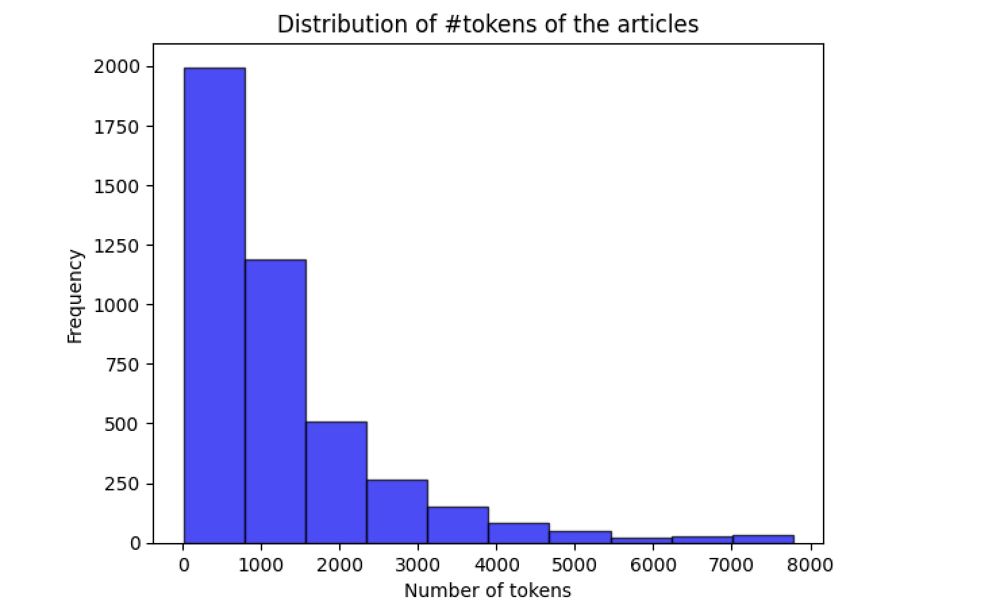
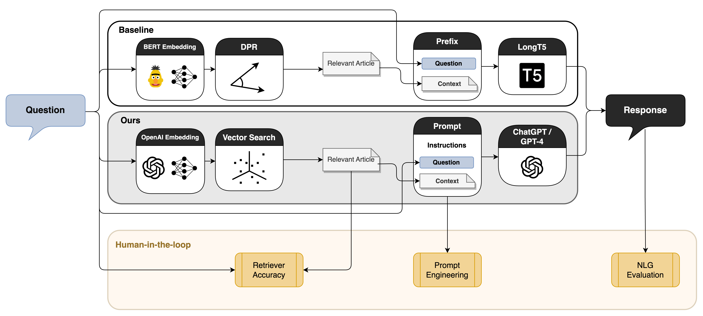

<!-- _class: lead -->
<!-- _footer: "https://arxiv.org/abs/2407.05925 · https://aclanthology.org/2024.dash-1.2/" -->

# Towards Optimizing and Evaluating a Retrieval Augmented QA Chatbot using LLMs with Human-in-the-Loop (2024)

## Anum Afzal, Alexander Kowsik, Rajna Fani, Florian Matthes

ACL DaSH 2024 · Human-in-the-Loop on industrial HR data

---

# Outline

1. Background & motivation
2. Problem & contributions
3. Dataset (FAQ + UT)
4. RAG pipeline (**Figure 1**, **Figure 2**)
5. Retriever & NLG modules
6. Evaluation & results (**Table 2**, **Table 3**)
7. Limitations & conclusion

---

# Background: LLMs in HR Support

- LLMs automate repetitive HR inquiries (Kurt Shuster et al., 2021)
- Employees need fast answers on pay, leave, benefits, policies
- Domain experts freed for higher-value work
- Effective chatbots improve employee satisfaction & engagement
- Industrial deployment requires **grounded**, policy-compliant answers

---

# SAP × TU Munich Collaboration

- SAP@TUM Collaboration Lab research project (Anum Afzal, Alexander Kowsik, Rajna Fani, & Florian Matthes, 2024)
- Goal: evaluate LLM potential on **real SAP HR data**
- Domain experts embedded across development cycles
- Focus: scalable HR chatbot for enterprise employee support
- Benchmark OpenAI models vs open-source baselines (LongT5, BERT)

---

# Problem Statement

- **RAG** reduces hallucinations via retrieval (Patrick Lewis et al., 2021)
- Retriever accuracy is measurable; **NLG quality is hard to evaluate**
- Generative answers diverge from reference text → BLEU/ROUGE mismatch
- How to align automatic metrics with **domain expert judgment**?
- Need HITL in data curation, prompt engineering, and evaluation

---

# Prior Work: RAG Systems

- RAG survey: retrieval + generation for LLMs (Yunfan Gao et al., 2024b)
- Dense retrieval: DPR (Vladimir Karpukhin et al., 2020)
- Industrial QA with domain-specific assistants (Chen et al., 2023; Wang et al., 2023)
- HR policy chatbots need relevant document grounding (Kelvin Guu et al., 2020b)
- Gap: few studies with **full HITL** on enterprise HR corpora

---

# Prior Work: NLG Evaluation

- N-gram metrics poorly suit generative LLM outputs (Jason Wei et al., 2021)
- LLM-based evaluators: G-Eval (Yang Liu et al., 2023), Prometheus (Seungone Kim et al., 2023)
- RAG-specific frameworks: RAGAs (Shahul Es et al., 2024), ARES (Jon Saad-Falcon et al., 2023)
- Open question: correlation with **human expert** scores in domain QA

---

# Contributions

- Industrial HR RAG chatbot with experts in **all** development loops
- Compare BERT DPR vs OpenAI retrievers + query transformations
- Benchmark ChatGPT, GPT-4, fine-tuned LongT5 for NLG
- Systematic evaluation: reference-based, reference-free, human (4 dimensions)
- Key finding: **GPT-4** best; G-Eval/Prometheus near human averages

---

# Research Questions

- **RQ1:** Which retriever works best — BERT DPR or OpenAI vector search?
- **RQ2:** Which NLG model best serves HR QA — ChatGPT, GPT-4, or LongT5?
- **RQ3:** Do G-Eval & Prometheus correlate with domain expert evaluation?
- **RQ4:** Where does HITL add the most value in the pipeline?

---

# Theoretical Background: RAG

- **Retrieve** relevant HR article → **generate** grounded answer (Patrick Lewis et al., 2021)
- Knowledge base: ~50k unique policy articles
- User metadata filters: region, employment status, company (Table 4)
- Baseline path: BERT DPR + fine-tuned LongT5
- Proposed path: OpenAI embeddings + ChatGPT/GPT-4 with engineered prompts

---

# Human-in-the-Loop (HITL)

- **Dataset:** experts curate FAQ gold Q&A; correct UT log mappings
- **Retriever:** experts verify retrieved article correctness
- **Prompts:** iterative 10–100 sample reviews by HR experts
- **Evaluation:** expert scores 100 samples × 4 dimensions (Likert 1–5)
- HITL is not optional for trustworthy industrial LLM apps

---

# Dataset Overview

- SAP internal HR policies: **Question · Answer · Context** triplets
- Metadata: region, company, employment status, applicable policies
- ~**50k** unique articles in knowledge base
- **6k** samples for retriever + end-to-end evaluation
- Two complementary sources: expert FAQ + real user utterances (UT)

---

# FAQ Dataset

- **N ≈ 48k** potential questions with gold answers (Anum Afzal, Alexander Kowsik, Rajna Fani, & Florian Matthes, 2024)
- Expert-curated from internal HR policies
- Covers payslips, leave, benefits, management topics
- High-quality reference answers for training & evaluation
- Forms the **gold standard** portion of the corpus

---

# UT Dataset (User Utterances)

- **N ≈ 41k** real user queries from prior chatbot iterations
- Semi-supervised mapping to FAQ questions via text matching
- Domain experts inspect and correct chatbot logs
- Captures **natural language** variation vs curated FAQ
- Combined with FAQ for robust real-world coverage

---

<!-- layout: figure -->

# Dataset Statistics (Figure 1)

*Source: Anum Afzal, Alexander Kowsik, Rajna Fani, & Florian Matthes (2024), Figure 1*

---

# Methodology Overview

- Standard RAG pipeline with per-module optimizations
- Two tracks: **Baseline** (BERT DPR + LongT5) vs **OpenAI** (embeddings + GPT)
- Query transformations: Intended Topics, HyDE, Multi-Query
- Prompt engineering tailored to SAP HR requirements (Table 5)
- Evaluation spans retriever accuracy and NLG quality

---

<!-- layout: figure -->

# Pipeline Architecture (Figure 2)

*Source: Anum Afzal, Alexander Kowsik, Rajna Fani, & Florian Matthes (2024), Figure 2*

---

# Retriever: BERT DPR

- Fine-tunes **bert-base-uncased** embeddings (Vladimir Karpukhin et al., 2020)
- Triplet loss: relevant article positive, two random negatives (Elad Hoffer & Nir Ailon, 2018)
- Paired with fine-tuned LongT5 in baseline framework
- Serves as benchmark for OpenAI retriever comparison
- **HR top-1 accuracy: 22.24%** — best among all methods (Table 2)

---

# Retriever: OpenAI Vector Search

- Embeddings: **text-embedding-ada-002**
- Similarity search over ~50k articles + metadata filters
- **Query transforms** (Orion Weller et al., 2024):
  - Intended Topics (Ma et al., 2023)
  - HyDE (Luyu Gao et al., 2022)
  - Multi-Query + Reciprocal Rank Fusion (Gordon V. Cormack et al., 2009b)
- HR top-1: 11.12% (Basic) — dataset noise limits gains

---

# NLG: Fine-tuned LongT5

- **LongT5-local-base** — 296M parameters (Mandy Guo et al., 2022)
- Fine-tuned on FAQ + UT (~86k samples, 7168 token window)
- Generative QA: question + retrieved article → answer
- Strong n-gram overlap with references → inflated BLEU/ROUGE
- Underperforms OpenAI models on human eval dimensions

---

# NLG: ChatGPT & GPT-4

- Prompt-driven generation: query + retrieved article → answer
- Extensive **prompt engineering** with HR expert feedback
- Final prompt in Table 5 after iterative small-batch reviews
- GPT-4 leverages strong internal reasoning despite noisy retrieval
- **Best overall** on G-Eval, Prometheus, and human scores (Table 3)

---

# Evaluation Framework

| Layer | Metrics |
|---|---|
| Retriever | top-1 accuracy |
| Reference-based | BLEU, ROUGE, BERTScore |
| Reference-free | G-Eval, Prometheus (1–5) |
| Human | Readability, Relevance, Truthfulness, Usability |

Correlation analysis: Spearman & Kendall (Wanjun Zhong et al., 2022)

---

# Human Evaluation Setup

- One SAP HR domain expert as human-in-the-loop evaluator
- **100 samples** × 3 models (LongT5, ChatGPT, GPT-4)
- **4 dimensions** on 5-point Likert scale (Rensis Likert, 1932)
- Expert also validated retriever article correctness
- Serves as baseline for automatic metric reliability analysis

---

# Automatic Metrics Detail

- **BLEU** (Kishore Papineni et al., 2002), **ROUGE** (Chin-Yew Lin, 2004): n-gram overlap
- **BERTScore** (Tianyi Zhang et al., 2019): contextual embedding similarity
- **G-Eval** (Yang Liu et al., 2023): GPT-4 judges QA quality via tailored prompts
- **Prometheus** (Seungone Kim et al., 2023): fine-tuned LM judge with rubrics
- 200 samples (BLEU/ROUGE/BERTScore); 60–100 for LLM judges

---

# Results: Retriever (Table 2)

| Method | HR top-1 | StackExchange top-1 |
|---|---|---|
| **BERT DPR** | **22.24%** | — |
| Basic (OpenAI) | 11.12% | 69.5% |
| Intended Topics | 9.33% | 57.25% |
| HyDE | 10.01% | 65.91% |
| Multi-Query | 10.92% | 71.31% |

*Source: Anum Afzal, Alexander Kowsik, Rajna Fani, & Florian Matthes (2024), Table 2*

---

<!-- layout: image-table -->

# Results: NLG Evaluation (Table 3)

| Metric | ChatGPT | GPT-4 | LongT5 |
|---|---|---|---|
| G-Eval Truthfulness | 4.12 | **4.80** | 3.36 |
| G-Eval Usability | 4.67 | **4.79** | 3.29 |
| Human Eval Readability | 4.31 | **4.76** | 4.02 |
| Human Eval Relevance | 4.31 | **4.67** | 3.46 |
| Human Eval Usability | 3.32 | **4.11** | 2.59 |
| BERTScore_F1 | 0.90 | **0.91** | 0.90 |

*Source: Anum Afzal, Alexander Kowsik, Rajna Fani, & Florian Matthes (2024), Table 3*

---

# Correlation Analysis

- GPT-4: **low** BLEU/ROUGE ↔ human correlation — diverse generations
- LongT5: higher n-gram metric correlation — answers mimic gold text
- G-Eval: strongest on **Truthfulness** dimension
- Prometheus: better on **Usability** than G-Eval
- Similar **averages ≠ high correlation** — metric choice matters (Wanjun Zhong et al., 2022)

---

# HITL Lessons Learned

- Wrong retrieved articles may still be **practically useful** (expert confirmed)
- GPT-4 reasons past noisy retrieval with internal domain knowledge
- Retriever top-1 accuracy is a **poor** proxy for end-to-end RAG quality on HR data
- Prompt iteration with experts is essential for production-ready responses
- Expert judgment remains critical for domain-specific QA (Anum Afzal, Alexander Kowsik, Rajna Fani, & Florian Matthes, 2024)

---

# Limitations & Ethics

- Closed OpenAI models — privacy & fine-tuning constraints
- Single domain expert — potential evaluation bias
- HR dataset not publicly released (data protection)
- Noisy retriever labels — many near-duplicate policy articles
- Ethics: anonymized data, paid expert evaluators, ACL Code of Ethics followed

---

# Conclusion & Takeaway

- **GPT-4 + RAG** is the best HR QA configuration (Table 3)
- **Figure 2:** HITL at dataset, retriever, prompt, and evaluation stages
- BERT DPR wins HR top-1 but absolute accuracy remains low
- G-Eval & Prometheus are promising **human proxies** — use with expert review
- Industrial LLM = **technology + expert loops**, not automation alone

**Key references:** Patrick Lewis et al. (2021); Yang Liu et al. (2023); Anum Afzal, Alexander Kowsik, Rajna Fani, & Florian Matthes (2024)
